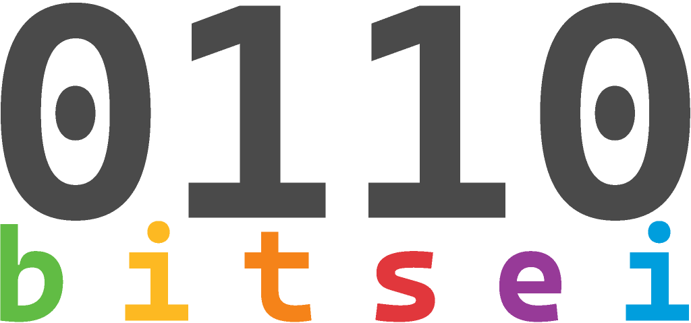

###

---
BITSEI (Business Integrated System for Electronic Invoicing)

Welcome to the Business Integrated System for Electronic Invoicing! Our web application is designed to help companies and professionals manage their business activities efficiently while staying compliant with Italian regulations.
Features:

- Generate XML invoices that comply with Italian regulations
- Keep track of customer activities and manage their data
- Improve financial decision-making with informed insights

### Getting Started

----

To get started with our application, please follow these steps:

    Clone the repository from Bitbucket
    Install the required dependencies using maven install
    Build the application using mvn clean package

### Usage
nothing to say init :)

---

### Contributors

---
- Mirco Cazzaro - 2076745
- Nicola Boscolo Cegion - 2074285
- Andrea Costa - 2061900
- Christian Marchiori - 2078343
- Marco Martinelli - 2087646
- Farzad Shami - 2090160
- Fabio Zanini - 2088628

<em>Web Applications course of <a href="http://www.unipd.it">University of Padova </a></em>
